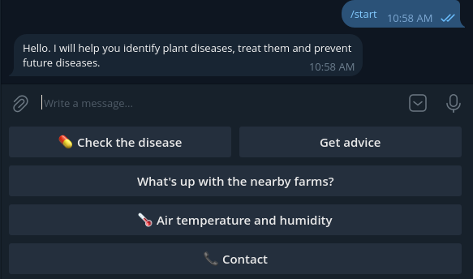

# Yaproq Bot
#### You can try the Yaproq Bot [enter through this link](https://t.me/yaproq1bot)
Open source data links that we used:

Weather: [OpenWeatherMap](https://openweathermap.org/)

DataSet: [Kaggle](https://www.kaggle.com/datasets/tolgahayit/yellowrust19-yellow-rust-disease-in-wheat)
#


<!-- GETTING STARTED -->
## Getting Started

Yaproq is telegram bot to predict and analysis wheat crop and find probability of yellow rust on the crop. It can detect the level of disease and gives the treatment recommendations. And also can predict the rate of yellow rust by using Humadity, temperature and current disease level.


### Installation

This are the steps to install the project and environment

- Clone the repo
   ```sh
   git clone https://github.com/Bahromiddin-0256/alpha-yaproq.git
   ```
- Create virtual environment  and activate
   ```sh
   virtualenv venv && source venv/bin/activate
   ```
- Install PyTorch to your computer [WebSite](https://pytorch.org/)
    ```sh
    pip3 install torch torchvision torchaudio --index-url https://download.pytorch.org/whl/cpu
    ```

- Install requirements (kerakli kutubxonalarni o'rnatib bo'lgunicha biroz vaqt olishi mumkin)
   ```sh
   pip install -r requirements.txt
   ```

- Copy [.env.example](https://github.com/Bahromiddin-0256/alpha-yaproq/blob/main/.env.example)  to .env and change variables to yours
   ```sh
   cp .env.example .env
   ```
- Malumotlar bazasini saqlang
    ```sh
    python manage.py makemigrations && python manage.py migrate
    ```
- Create super user
    ```sh
    python manage.py createsuperuser
    ```
- To run the bot in development run and to run the bot in production just run
    ```sh
    python manage.py runbot
    uvicorn main.asgi:application
    ```


<!-- USAGE EXAMPLES -->
## Usage
After you press the start button, there will be appear menu and you can choose one of them. You can check the disease and its level by sending the picture and also you can check the situation on the near farms and check the weather information. If there is any problem with the near farms or weather that might be cause to yellow rust, we will warn you and give recommendations.



#

# You can watch the video in here : [Video Link](https://drive.google.com/file/d/1o5vLT0GODdQGHL8FIgKSQ_dO0VyhggBH/view?usp=drivesdk)

### Or this watch:
<video src="video_2023-11-12_13-47-49.mp4" controls title="Title"></video>
#
See the [open issues](https://github.com/Bahromiddin-0256/alpha-yaproq/issues) for a full list of proposed features (and known issues).


<!-- CONTRIBUTING -->
## Contributing

Contributions are what make the open source community such an amazing place to learn, inspire, and create. Any contributions you make are **greatly appreciated**.

If you have a suggestion that would make this better, please fork the repo and create a pull request. You can also simply open an issue with the tag "enhancement".
Don't forget to give the project a star! Thanks again!

1. Fork the Project
2. Create your NewUser Branch (`git checkout -b NewUser`)
3. Commit your Changes (`git commit -m 'Add some from NewUser'`)
4. Push to the Branch (`git push origin NewUser`)
5. Open a Pull Request


<!-- CONTACT -->
## Contact
ALPHA team:

- 👨‍💻 [Ibragimov Bahromiddin](https://github.com/Bahromiddin-0256)

- 👨‍💻 [Mamatmusayev Jaloliddin](https://github.com/jaloliddin1006)

- 👨‍💻 [Sindarov Jo'rabek](https://github.com/jurabek004)

- 👨‍💻 [Muhammadaliyev Nodirjon](https://github.com/muhammadaliyevnodirjon)

- 👨‍💻 [Hasanov Diyorbek](https://github.com/)

Project Link: [https://github.com/Bahromiddin-0256/alpha-yaproq](https://github.com/Bahromiddin-0256/alpha-yaproq)
